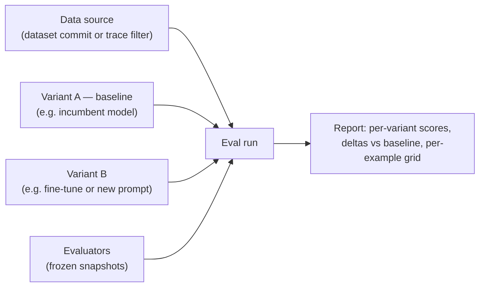

Eval is how quality becomes a number you can plan around. You define what a good response looks like for a specific agent, and Overmind scores that agent's outputs against it — in batch runs that compare models and prompts side by side, and continuously on production traces as they arrive. The same evaluators serve both, which is the point: the score that gates an [optimization](/agent-testing/optimizers) or a [fine-tune](/models/training) is the same score you watch in production, so a gain measured offline means something online.

The Evaluations area of the console has three surfaces: **Runs** (the experiments you've executed), **Eval Sets** (the named groupings that define what scores an agent), and the **Eval Library** (every evaluator available to you, shipped and self-authored).

## Evaluators

An evaluator is one reusable question asked of a response — *is this correct? did it call the right tool? is the JSON valid?* Evaluators are versioned: editing one creates a new version, so a run scored last month still means what it meant then.

Different questions need different machinery, so evaluators come in several kinds:

<AccordionGroup>
  <Accordion title="LLM judge">
    A model grades the response against a rubric you write in plain language. The rubric is compiled into a checklist of atomic, weighted questions — some can be marked as gates that force a fail regardless of the rest of the score. Judges return their reasoning and per-item sub-scores alongside the number, so a low mark is an explanation, not a mystery. For higher-stakes metrics you can configure a panel of judges rather than a single model.
  </Accordion>
  <Accordion title="Deterministic">
    A fixed rule with no model involved: exact match, contains, valid JSON, tool-selection checks. Fast, free, and unambiguous — use these wherever the question has a mechanical answer.
  </Accordion>
  <Accordion title="Trajectory">
    Judges the *path* the agent took — the sequence of steps and tool calls — rather than just the final output. Useful when a right answer reached the wrong way is still a problem.
  </Accordion>
  <Accordion title="Agentic">
    An LLM judge built for long, multi-step agent runs, where there is a lot of trajectory to read and summarize before scoring.
  </Accordion>
  <Accordion title="Statistical">
    Scores a whole dataset at once rather than one example at a time: accuracy, precision, recall, F1, and text-similarity measures.
  </Accordion>
  <Accordion title="Decision graph">
    Evaluates structured decision logic — whether the agent's choices followed the expected branching for the situation.
  </Accordion>
</AccordionGroup>

Every evaluator declares its **scope** (final output, a single turn, a step, the whole trajectory, or the dataset), its **score type** (numeric, categorical, or boolean) and its **pass threshold**. Evaluators also declare what evidence they need — a reference answer, the full trajectory, the model output. If a run can't supply that evidence, the evaluator is marked *not applicable* rather than scoring garbage, and the console warns you at authoring time.

### The built-in library

Overmind ships evaluators for the questions teams ask most: Correctness, Faithfulness, Hallucination, Answer Relevance, Conciseness, Toxicity, Role Adherence, Policy Compliance, Task Completion, Tool Selection Quality, Trajectory Accuracy, Exact Match, JSON Validity, and Translation Quality. Some (Correctness, Faithfulness, Exact Match among them) require a reference answer in your data; the console tells you which. Use them as-is, adjust them, or treat them as templates for your own.

The library distinguishes **generic** evaluators (project-wide or platform-shipped) from **bespoke** ones scoped to a single agent. A triage agent and a planner shouldn't share scoring criteria, and scoping keeps them from doing so accidentally.

### Writing and generating evaluators

You can author an evaluator by hand — name it, write the rubric, review the compiled checklist, preview it against sample data before committing. Or you can have Overmind **generate evaluators** for you: it reads the agent's capability profile and the dataset you point it at, drafts deterministic checks for the mechanical criteria and LLM-judge rubrics for the semantic ones, and presents them as suggestions with a coverage summary. Nothing is saved until you accept the ones you want. Generated evaluators are grounded in what *your* agent is supposed to do — its tools, its output contract, its failure modes — which is what makes them worth reviewing rather than discarding.

{/* TODO(screenshot): Generated evaluator suggestions with the accept checkboxes and coverage rollup */}

## Eval sets

An eval set is a named group of an agent's evaluators — the working definition of "good" for that agent. An agent can hold several sets, with one marked **active**; the active set is what scores optimization candidates, gates fine-tunes, and is preselected in run wizards.

Each member of a set carries a role:

- **Generative** members score outputs produced during eval runs and experiments.
- **Trace scoring** members run on live production traces as they arrive, putting quality scores directly into [Observability](/core/observability#scores-on-arrival).

The same evaluator can serve in both roles. A set is runnable as soon as it has members — there is no separate approval step.

## Eval runs

An eval run is a controlled experiment: **one data source × N variants × M evaluators.**

**The data source** is either a dataset — with the exact dataset commit recorded, so the run stays reproducible even as the dataset evolves — or a trace filter that draws directly from captured production traffic. You can cap how many items are drawn.

**Variants** are the columns of your experiment. A variant either grades **existing** traces as-is or **generates** fresh outputs by re-running the model on each datapoint. Each variant pins a model — a catalog model, a registered endpoint, or one of your fine-tunes — and optionally a prompt version. One variant is the **baseline**, and every other variant's results are reported as deltas against it. Comparing your production setup against a candidate model is exactly this: two variants, one run.

**Evaluators** are attached as frozen snapshots at run creation. Edits or deletions in the library afterward can't quietly change what a completed run measured.

Runs move through pending, running, and completed states, can be cancelled mid-flight, and show live progress while running: per-variant generation progress, scores so far, errors so far, and the latest responses streaming in as they're produced.

### Reading the report

A finished run reports per-variant rollups — average score, pass rate, example count — plus a ranking and deltas against the baseline, per metric. From there you drill down: a per-datapoint table, and inside each datapoint the full picture of what the model did versus what the reference did, with each evaluator's score and reasoning attached. Dataset-level statistical scores are called out separately from per-example ones, so aggregates never masquerade as individual judgments.

Two details in the scoring model are worth understanding:

- **Outcomes are typed.** Each score is Scored, Abstained, Not applicable, Skipped, or Error — and only *Scored* results feed the averages and pass rates. An evaluator that couldn't fairly judge an example doesn't drag the numbers down.
- **Samples can be degraded.** Before scoring, each trace is normalized into a canonical transcript. If a trace can't be faithfully reconstructed, its sample is marked degraded and excluded from aggregates rather than counted as a model failure — surfaced separately so you can see what was left out. Long-trace samples also record how much of the trace the judge actually saw.

Run reports can be shared by link. Links are auth-gated — viewers must be signed in and either be project members or, if you explicitly widen the link, any authenticated user. Links can be labeled, expired, and revoked; there are no anonymous public URLs.

{/* TODO(screenshot): Run report with variant comparison and a sample drill-down open */}

### Score history

Evaluator scores accumulate into a history per agent, which powers the trend charts on the agent page and the "latest score" column on eval sets. This is the long-term payoff: after a few weeks of runs, "did the agent get better this month?" has a chart instead of an argument.

## Calibrating judges

LLM judges are only as trustworthy as their agreement with you. Samples accept **annotations** — human labels with an optional note — which give you a ground-truth signal to compare judge behavior against. When a judge and your annotations disagree consistently, tighten the rubric; the checklist compilation makes it easy to see which specific criterion is drifting.

## How Eval connects

- **Datasets** supply the rows, and the Workshop's readiness verdict tells you whether a dataset can support the evaluators you've chosen — see [Datasets](/core/datasets).
- **Observability** displays live trace scores from the active set's trace-scoring members, and eval runs can draw directly from trace filters — see [Observability](/core/observability).
- **The Optimizer** scores every candidate change with the agent's pinned eval set, so optimization is measured exactly like evaluation — see [Optimizers](/agent-testing/optimizers).
- **Training** runs judge evals against your production model before, during, and after a fine-tune, using the rubric you select at launch — see [Training](/models/training).

## Getting started sensibly

Begin with three to five metrics, not fifteen. Pick one or two deterministic checks for your output contract (JSON validity, tool selection), one judged metric for the quality dimension you actually care about, and — if you have references — Correctness. Run them against a small real dataset, read the per-example reasoning, and adjust the rubric where the judge misunderstood you. Only then scale up the dataset and add metrics. Teams that start with a wall of metrics tend to trust none of them; teams that start with three they've verified tend to keep all three for a year.
