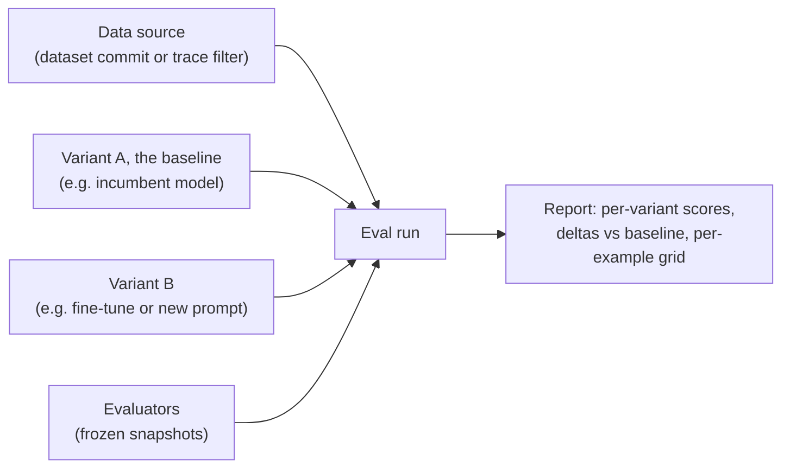

Eval is where you measure your agent's quality. You define what a good response looks like for a specific agent, and Overmind scores that agent's outputs against it, both in batch runs that compare models and prompts side by side and continuously on production traces as they arrive. The same evaluators score offline runs and live traffic, so an improvement measured offline holds up in production.

The Evaluations area of the console has three surfaces: **Runs** (the experiments you've executed), **Eval Sets** (the named groupings that define what scores an agent), and the **Eval Library** (every evaluator available to you, shipped and self-authored).

## Evaluators

An evaluator is one reusable question asked of a response: *is this correct? did it call the right tool? is the JSON valid?* Evaluators are versioned. Editing one creates a new version, so a run scored last month still means what it meant then.

Different questions need different kinds of evaluators:

<AccordionGroup>
  <Accordion title="LLM judge">
    A model grades the response against a rubric you write in plain language. The rubric is compiled into a checklist of atomic, weighted questions, some of which can be marked as gates that force a fail regardless of the rest of the score. Judges return their reasoning and per-item sub-scores alongside the number, so you can see why a response scored low. For higher-stakes metrics you can configure a panel of judges instead of a single model.
  </Accordion>
  <Accordion title="Deterministic">
    A fixed rule with no model involved: exact match, contains, valid JSON, tool-selection checks. Fast, free, and unambiguous. Use these wherever the question has a mechanical answer.
  </Accordion>
  <Accordion title="Trajectory">
    Judges the *path* the agent took, the sequence of steps and tool calls, and not just the final output. Useful when a right answer reached the wrong way is still a problem.
  </Accordion>
  <Accordion title="Agentic">
    An LLM judge built for long, multi-step agent runs, where there is a lot of trajectory to read and summarise before scoring.
  </Accordion>
  <Accordion title="Statistical">
    Scores a whole dataset at once instead of one example at a time: accuracy, precision, recall, F1, and text-similarity measures.
  </Accordion>
  <Accordion title="Decision graph">
    Evaluates structured decision logic, checking whether the agent's choices followed the expected branching for the situation.
  </Accordion>
</AccordionGroup>

Every evaluator has a **scope** (final output, a single turn, a step, the whole trajectory, or the dataset) and a **pass threshold**, though the console shows both as plain-language descriptions rather than raw fields you edit. **Score type** (numeric, categorical, or boolean) is the one you actually choose when authoring an evaluator. Evaluators also declare what evidence they need, such as a reference answer, the full trajectory, or the model output. If a run can't supply that evidence, the evaluator is marked *not applicable* instead of producing a meaningless score, and the console warns you at authoring time.

### The built-in library

Overmind ships evaluators for the questions teams ask most: Correctness, Faithfulness, Hallucination, Answer Relevance, Conciseness, Toxicity, Role Adherence, Policy Compliance, Task Completion, Tool Selection Quality, Trajectory Accuracy, Exact Match, JSON Validity, and Translation Quality. Some (Correctness, Faithfulness, and Exact Match among them) require a reference answer in your data; the console tells you which. Use them as-is, adjust them, or treat them as templates for your own.

The library distinguishes **generic** evaluators (project-wide or platform-shipped) from **bespoke** ones scoped to a single agent. A triage agent and a planner shouldn't share scoring criteria, and scoping keeps them from doing so accidentally.

### Writing and generating evaluators

You can author an evaluator by hand from the Eval Library: name it, write the rubric, review the compiled checklist, and preview it against sample data before committing. Overmind also authors a starter set for each agent automatically as part of the repository scan, grounded in the agent's tools, output contract, and failure modes. These are saved directly rather than held back for a separate approval step, so treat them like any other evaluator: keep what fits, edit or archive what doesn't.

{/* TODO(screenshot): Eval Library with a mix of scan-authored and hand-authored evaluators */}

## Eval sets

An eval set is a named group of an agent's evaluators, the working definition of "good" for that agent. An agent can hold several sets, for example a broad one for regression coverage and a focused one for a specific behaviour, and you pick which set an optimisation run or a training benchmark measures with when you set it up.

Each member of a set carries a role:

- **Generative** members score outputs produced during eval runs and experiments.
- **Trace scoring** members run on live production traces as they arrive, putting quality scores directly into [Observability](/core/observability#scores-on-arrival).

The same evaluator can serve in both roles. A set is runnable as soon as it has members; there is no separate approval step.

## Eval runs

An eval run is a controlled experiment: **one data source × N variants × M evaluators.**

**The data source** is either a dataset or a trace filter that draws directly from captured production traffic. For datasets, the exact commit is recorded, so the run stays reproducible even as the dataset evolves. You can cap how many items are drawn.

**Variants** are the columns of your experiment. A variant either grades **existing** traces as-is or **generates** fresh outputs by re-running the model on each datapoint. Each variant pins a model (a catalogue model, a registered endpoint, or one of your fine-tunes) and optionally a prompt version. One variant is the **baseline**, and every other variant's results are reported as deltas against it. Comparing your production setup against a candidate model is exactly this: two variants, one run.

**Evaluators** are attached as frozen snapshots at run creation. Edits or deletions in the library afterward can't quietly change what a completed run measured.

Runs move through pending, running, and completed states, can be cancelled mid-flight, and show live progress while running: per-variant generation progress, scores so far, errors so far, and the latest responses streaming in as they're produced.

### Reading the report

A finished run reports per-variant rollups (average score, pass rate, example count) plus a ranking and deltas against the baseline, per metric. From there you drill down into a per-datapoint table, and inside each datapoint the full picture of what the model did versus what the reference did, with each evaluator's score and reasoning attached. Dataset-level statistical scores are called out separately from per-example ones, so aggregates are never presented as individual judgments.

Two details in the scoring model are worth understanding:

- **Outcomes are typed.** Each score is Scored, Abstained, Not applicable, Skipped, or Error, and only *Scored* results feed the averages and pass rates. An evaluator that couldn't fairly judge an example doesn't drag the numbers down.
- **Samples can be degraded.** Before scoring, each trace is normalised into a canonical transcript. If a trace can't be faithfully reconstructed, its sample is marked degraded and excluded from aggregates, surfaced separately so you can see what was left out. Long-trace samples also record how much of the trace the judge actually saw.

Run reports can be shared by link. Links are auth-gated: viewers must be signed in, and must either be project members or, if you explicitly widen the link, any authenticated user. Links can be labelled, expired, and revoked. There are no anonymous public URLs.

{/* TODO(screenshot): Run report with variant comparison and a sample drill-down open */}

### Score history

Evaluator scores accumulate into a history per agent, which powers the trend charts on the agent page and the "latest score" column on eval sets. This is the long-term payoff: after a few weeks of runs, you can see on a chart whether the agent got better this month.

## Calibrating judges

LLM judges are only as trustworthy as their agreement with you. Samples accept **annotations**, human labels with an optional note, which give you a ground-truth signal to compare judge behaviour against. When a judge and your annotations disagree consistently, tighten the rubric. The checklist compilation makes it easy to see which specific criterion is drifting.

## How Eval connects

- **Datasets** supply the rows, and the Workshop's readiness verdict tells you whether a dataset can support the evaluators you've chosen. See [Datasets](/core/datasets).
- **Observability** displays live trace scores from the agent's trace-scoring evaluators, and eval runs can draw directly from trace filters. See [Observability](/core/observability).
- **The Optimiser** scores every candidate change with the eval set pinned at run creation, so optimisation is measured exactly like evaluation. See [Optimisers](/agent-testing/optimisers).
- **Training** runs judge evals against your production model before and after a fine-tune, using the rubric you select at launch. See [Training](/models/training).

## Getting started sensibly

Begin with three to five metrics, not fifteen. Pick a deterministic check or two for your output contract (JSON validity, tool selection), one judged metric for the quality dimension you actually care about, and Correctness if you have references. Run them against a small real dataset, read the per-example reasoning, and adjust the rubric where the judge misunderstood you. Only then scale up the dataset and add metrics.
