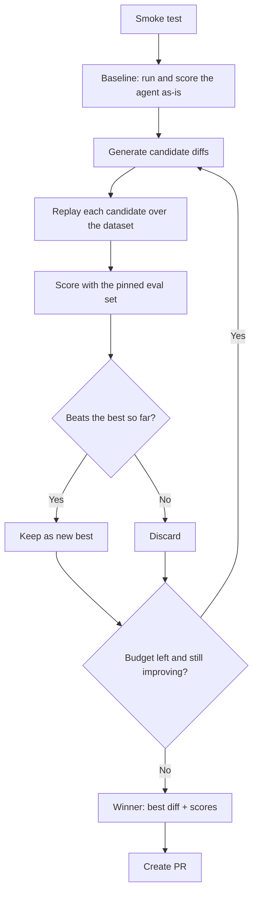

The Optimizer takes an agent you can already measure and tries to make it better by editing the agent itself. Candidates are real diffs against your repository: rewritten prompts, sharpened tool descriptions, a different model choice, adjusted control flow. Each candidate is scored on your dataset with your evaluators, and only a change that measurably beats the baseline survives. The winning change arrives as a pull request you review like any other.

This is the alternative to the manual inner loop of reading the failing trace, tweaking the prompt, redeploying, and waiting. That loop works, but it can't keep up once an agent is handling real volume. The Optimizer automates it while leaving the decision to ship with you.

## What it can change

Candidates may touch prompts and instructions, tool definitions, model selection, and orchestration logic. The boundary is set by the agent's evaluation spec, which divides the agent into **optimizable elements** and **fixed elements** (see [Agents](/core/agents#what-a-scan-produces)). Anything marked fixed is off-limits no matter how tempting the score gain. This is how you keep business rules, compliance-critical wording, or a mandated model out of the blast radius.

## Before you start

An optimization run has four prerequisites, and the setup wizard walks them as a checklist:

<Steps>
  <Step title="An agent from your code">
    The agent must come from a connected repository, since candidates are edits to that code. See [Agents](/core/agents).
  </Step>
  <Step title="A dataset to replay">
    The run replays the agent over the datapoints of the dataset you pick in the wizard. The inputs must be a shape the agent can be invoked with (text, object, or messages); the console blocks the run and explains why when they aren't. See [Datasets](/core/datasets).
  </Step>
  <Step title="An eval set to score with">
    Candidates are graded by the eval set you choose, pinned when the run is created so later edits can't change an in-flight run's yardstick. A run without runnable evaluators technically completes, but its scores mean little. Set up metrics first. See [Eval](/agent-testing/eval).
  </Step>
  <Step title="A connected CLI">
    Your agent executes in your environment, not Overmind's. The `overmind` CLI runs a local executioner that applies candidate diffs and runs the agent against your repo, authenticated with your API key. The wizard shows the command to run and the live connection status; the run page shows which machine and CLI version are connected.
  </Step>
</Steps>

You also set a **run budget**: how many optimization iterations, and how many candidates per iteration. The defaults are five iterations of three candidates, stopping early after three iterations without improvement, which balances thoroughness against time and cost.

## How a run works

A run opens with a **smoke test**. Before spending anything, Overmind verifies it can actually invoke your agent's entrypoint. If the smoke test keeps failing, the run stops there with a clear message instead of producing a result you can't trust.

Then it measures the **baseline**: your agent exactly as it is, scored across the whole dataset. Iteration zero on the run page is always this baseline, and every later score is read against it.

Each subsequent **iteration** generates a batch of candidate diffs, each biased toward a different area of the agent. One might rework the system prompt, another the tool descriptions, another the control flow. Candidates are validated (does the code still parse, does the entrypoint still exist, does it survive a quick sample?) before the expensive full replay, then run across every datapoint and scored with your evaluators. The best surviving candidate becomes the new starting point only if it genuinely improves on the best score so far.

Improvement is judged conservatively. A candidate that lifts the average while tanking a handful of individual cases is usually memorizing the test set, so per-case regressions count against acceptance. A held-out slice of data the loop never sees is used to check the final result for overfitting, and candidates are penalized for bloating prompts or code, since "solving" a dataset by stuffing it into the prompt is a cheap trick that shouldn't pay. Expected outputs are kept away from the model that writes the fixes, so candidates can't copy the answers in.

When iterations stop producing gains, the run ends, either by exhausting its budget or by early-stopping after consecutive stalls.

## Following a run

The run page shows the loop as it happens. The header carries the numbers that matter (**baseline score**, **best score**, iterations completed, candidates evaluated) with a score chart across iterations and a plateau indicator when gains flatten. Each iteration expands into its candidates, and each candidate into its patch, which you can view, copy, or download. Below that, a command log records every datapoint execution the local CLI performed, including the smoke test, so a failing candidate shows you *why* it failed and not just a low score.

Runs can be cancelled at any point, and the executioner's status is always visible. If the local CLI disconnects mid-run, you'll see it here instead of wondering why progress stopped.

{/* TODO(screenshot): Optimization run page with the score chart, iterations, and an expanded candidate patch */}

## The result is a pull request

A finished run reports the winning diff with its score and the improvement over the baseline, summarized alongside what was tried and rejected. **Create PR** opens a pull request in your connected repository containing the winning change, with the baseline-versus-candidate scores in the description. From there it's your normal review process: read the diff, run your CI, merge or close. Overmind never pushes changes into your codebase on its own.

Because candidates were scored with the same evaluators you use everywhere else, the number on the PR is directly comparable to your eval runs and your live trace scores. One yardstick, end to end.

## When optimization stops paying

Prompt and logic changes have a ceiling. When runs start plateauing and the best score refuses to move across experiments, the honest reading is that the remaining gap lives in the model, not the scaffolding around it. The run page says so explicitly and points you toward [Training](/models/training). A model fine-tuned on this agent's own data is usually the next meaningful step, and by this point you already have everything it needs: a curated dataset and a trusted eval set.

## Good to know

- The quality of a run is bounded by what you measure. If your evaluators don't capture what you actually care about, the Optimizer will faithfully improve the wrong thing. Spend the time in [Eval](/agent-testing/eval) first.
- Runs execute your agent for real, on your data, many times. Model costs from those executions are yours, and the run's budget (iterations × candidates × datapoints) is the lever to control them.
- The eval set is pinned at creation, but the *dataset* defines the situations explored. A narrow dataset produces improvements narrow to match, so promote fresh traces into it periodically and optimization keeps chasing reality.
- Pausing and resuming is supported. A resumed run continues from its recorded state instead of starting over.
