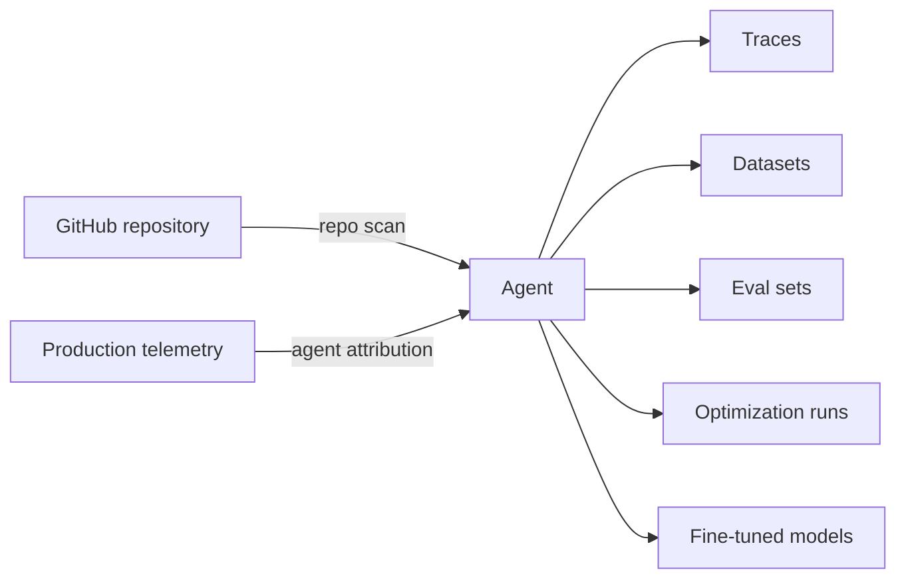

An agent in Overmind is a model of an agent you already run: the support triager, the lead qualifier, the document extractor that lives in your repository and serves real traffic. You don't build agents inside Overmind. Overmind discovers them, reads how they work, and keeps a live picture of the prompts, the tools, the control flow, and the behavior they actually exhibit in production.

That picture is the reference point for the rest of the platform. Traces attach to an agent. Datasets are checked for fit against an agent. Evaluators are scoped to an agent's job. Optimization runs edit an agent's code, and fine-tuned models are trained to replace an agent's production model. If you understand the agent page, you understand how the platform hangs together.

## Why agents are modeled from code

A pile of traces tells you what your agent *did*. Only the code tells you what it *could do*: which tools exist, which branches never fire, what the output contract is supposed to be. Overmind reads both sides and joins them, static structure from your repository with runtime behavior from your telemetry. The gap between the two is often where the interesting problems live, such as a tool that is defined but never called, or a code path production traffic never exercises.

Working from code also means improvements land as code. When the [Optimizer](/agent-testing/optimizers) finds a better prompt or a sharper tool description, the result is a reviewable diff against your actual repository, not a suggestion you have to transcribe by hand.

## How agents get into Overmind

There are two paths, and most teams end up using both.

### Scanning a repository

Connecting a repository gives Overmind the structural half of the picture.

<Steps>
  <Step title="Connect GitHub">
    For a private repository, install the Overmind GitHub App from **Settings**. During installation you choose exactly which repositories Overmind can see; it never gets blanket access. For a public repository, paste its URL instead. No GitHub account connection is needed for that.
  </Step>
  <Step title="Pick a repository and branch">
    Choose the repository and the branch that represents the agent you want to work on. The default branch is preselected.
  </Step>
  <Step title="Let the scan run">
    Overmind clones the branch and reads the codebase. The status updates as it works, and a live label tells you what it is doing at that moment, such as searching for agents or mapping tools. If something fails, you get a short explanation and can run the scan again.
  </Step>
  <Step title="Review the discovered agents">
    Each agent found in the code appears in your project with its prompt, tools, and control flow already mapped. Confirm the picture matches your understanding of the code before you build on top of it.
  </Step>
</Steps>

The scan works with the common Python agent frameworks (LangGraph and LangChain, CrewAI, the OpenAI Agents SDK, AutoGen, PydanticAI, smolagents) as well as plain Python. Framework awareness matters most later, when the Optimizer needs to edit the code safely.

{/* TODO(screenshot): Repository scan in progress with the live status label */}

### Arriving through telemetry

Agents can also appear from the other direction. When your application sends traces with an agent identity attached, either an `agent_id` or a stable `agent_name` set in the tracing SDK, Overmind creates or attaches the agent record at ingest. This is how an agent shows up before you've connected its repository, and it's why keeping the agent name stable matters: a name that changes between deploys produces duplicate agents. [Observability](/core/observability#attributing-traces-to-an-agent) covers attribution in detail.

An agent discovered from code and the same agent reporting telemetry resolve to one record, so the structural view and the runtime view stay joined.

## What a scan produces

Beyond the agent entry itself, a completed scan yields a set of artifacts you'll keep coming back to:

<CardGroup cols={2}>
  <Card title="Flow graph" icon="diagram-project">
    An interactive map of the agent's control flow: the steps it runs, the tools it can call, and how they connect. Expandable to a full-page canvas.
  </Card>
  <Card title="Components with provenance" icon="code">
    Every tool and supporting component the scan found, each linked back to the file that defines it in your repository.
  </Card>
  <Card title="System prompt" icon="file-lines">
    The exact prompt the agent runs with, lifted from the code and shown beside the flow graph. The fastest way to review what the agent is actually being told.
  </Card>
  <Card title="Proposed evaluation criteria" icon="list-check">
    A first draft of what to measure for this specific agent, derived from its purpose, tools, and failure modes. You review these in [Eval](/agent-testing/eval).
  </Card>
</CardGroup>

The scan also produces an evaluation spec for the agent: its input schema, expected output fields, tool configuration, and consistency rules, along with which parts of the agent are **optimizable** and which are **fixed**. That boundary is what keeps an optimization run inside the lines you set. The Optimizer may rewrite an optimizable prompt, but it will not touch an element you've marked fixed.

## Inside an agent

Open an agent from the **Agents** list to see everything Overmind knows about it. The header carries the agent's name, editable display name, a link to its source repository, and quick actions: copy the agent ID (you'll need it for trace attribution), jump to its traces in Observability, or archive it.

The page is organized into four tabs.

### Overview

The facts bar summarizes the agent's identity and configuration at a glance, including the model it runs in production. Overmind calls that model the **incumbent**, and it becomes the baseline that fine-tuned models are later measured against. Below the facts bar sit the system prompt card, the flow graph, and the components explorer. This tab is the fastest way to sanity-check that Overmind read your code correctly, and the first place to look when an agent is unfamiliar.

{/* TODO(screenshot): Agent Overview tab with the flow graph and components explorer */}

### Dataset

The datasets attached to this agent, promoted from its traces or uploaded, ready to inspect, curate, and point runs at. Building and curating datasets is covered in [Datasets](/core/datasets).

### Eval metrics

This tab holds the agent's evaluators and its **eval sets**, the named groupings of evaluators that define what "good" means for this agent. The **Optimize** button lives here too, because starting an optimization only makes sense once the agent has a way to be judged. See [Eval](/agent-testing/eval) for the full model.

### Models

The models associated with the agent: the incumbent it runs today and any models fine-tuned from its data. From here you can jump into a deployed model's [Inference](/models/inference) page or start a new [Training](/models/training) run pinned to this agent.

## Keeping the picture current

Overmind remembers the commit it last scanned and compares it against the head of your branch. When the branch moves on, the agent shows as out of sync and prompts you to re-analyze. Re-analysis rebuilds the discovered structure from the current code and, at the same time, re-assesses what the code needs for observability coverage. You'll also be told if the branch was deleted or the repository became unreachable.

The console can also warn you when the CLI version last seen from your environment is behind, which matters for [optimization runs](/agent-testing/optimizers) that execute locally.

<Note>
Archiving an agent hides it from the list but does not destroy anything; it can be restored later. There is no hard delete of an agent from the console.
</Note>

## Typical adoption path

Most teams follow roughly the same arc. First they connect a repository and check the flow graph against reality, which usually takes minutes and occasionally surfaces a surprise about their own code. Then they turn on tracing so the agent's page fills with production behavior. From there the order varies: some teams go straight to curating a dataset from traces, others start by reviewing the proposed evaluation criteria. Either way, the agent page becomes home base, the one view where data, metrics, runs, and models for an agent stay together.

## Where agents connect

- Traces carry an agent identity, and the agent's page links straight into its filtered trace view. See [Observability](/core/observability).
- Datasets can be bound to an agent, which unlocks agent-fit checks in the Data Workshop. See [Datasets](/core/datasets).
- Evaluators and eval sets are scoped per agent, so a triage agent is never scored on a planner's criteria. See [Eval](/agent-testing/eval).
- The [Optimizer](/agent-testing/optimizers) edits the agent's code within its optimizable elements and opens the winning change as a pull request.
- [Training](/models/training) benchmarks every fine-tune against the agent's incumbent model before you switch anything over.
