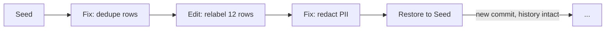

A dataset is the curated half of your data. Traces record what your agent actually did; a dataset is the set of examples you've decided are worth measuring and learning from. Every evaluation run, optimization run, and fine-tune on the platform consumes a dataset, so the quality of your datasets limits the quality of everything built from them.

Opening any dataset takes you into the **Data Workshop**, a console that scores the dataset's health, finds problems, proposes verified fixes, and keeps a commit history of every change.

## Key concepts

**Datapoints.** A dataset is a collection of datapoints. Each one carries an input, optionally an expected output, and optional extras such as a persona or tags. Columns that don't fit the canonical shape are preserved verbatim, so a transform never silently drops your data. A datapoint built from a trace also keeps a link to its source trace, which means any row can be audited back to the run that produced it.

**Intent.** Every dataset declares what it is *for*, once, at ingestion:

| Intent | Shape | Consumed by |
| --- | --- | --- |
| **Eval** | `input` + optional `expected_output` | [Eval runs](/agent-testing/eval), the [Optimizer](/agent-testing/optimizers) |
| **Fine-tuning** | Chat-style `messages`, optionally with `tools` | [Training](/models/training) |
| **Unstructured** | Verbatim rows, no structural guarantees | Exploration and later re-ingestion |

Intent is immutable. To use eval data for fine-tuning (or vice versa), you re-ingest: Overmind derives a new dataset in the target shape and records what it came from. The original is never mutated. This is deliberate. A dataset that silently changed shape under a running eval or training job would make results unreproducible.

**Surface.** Datasets built from traces also choose a surface: the **agent** surface (agent input in, delivered answer out) or the **model** surface (the raw LLM call inside the agent). Train on the model surface when you want to replace the model inside the agent; evaluate on the agent surface when you care about what the user received.

## Where datasets come from

<Tabs>
  <Tab title="From traces">
    The most valuable examples are the ones your agent actually faced. Select traces in [Observability](/core/observability), filtered by agent, status, time window, or score, and create a dataset from the selection, or append to an existing one. Each resulting datapoint keeps its source trace link, and duplicates from the same trace are caught automatically.
  </Tab>
  <Tab title="Upload">
    Drag a file anywhere onto the Datasets page, or use the create dialog. CSV, TSV, JSON, and JSONL are accepted. Uploads are the usual path for seed sets, labeled ground truth, and data exported from another system.
  </Tab>
  <Tab title="From a connector">
    Traces synced from a connected observability tool (Langfuse, LangSmith, and others; see [Observability](/core/observability#importing-from-observability-tools)) land as traces first, then follow the same select-and-promote path as native traces.
  </Tab>
</Tabs>

A dataset can be bound to a specific agent or left project-scoped. Binding matters: it unlocks the agent-fit checks described below and surfaces the dataset on that agent's page.

## The Data Workshop

Opening a dataset opens the Workshop. Its job is to answer one question: is this data ready for what you intend to do with it? Then it helps you fix whatever isn't.

{/* TODO(screenshot): Data Workshop with a scored dataset, verdict, and pillar breakdown */}

### Analysis, score, and verdict

Running an analysis produces a report, a score out of 100, and a readiness verdict: **Ready**, **Ready with warnings**, **Needs work**, or **Not ready**. The scoring lens follows the dataset's intent. An eval dataset is judged on eval compatibility, a fine-tuning dataset on training compatibility, and an unstructured one on general data quality. The analysis combines two passes: deterministic checks that run in seconds, and an AI analyst pass that reads the corpus for the problems rules can't express, such as label conflicts, answer leakage, or degenerate outputs.

### Pillars and checks

The score rolls up from weighted pillars, areas of dataset health such as conversation integrity, training signal, reference quality, coverage, uniqueness, consistency, volume, and safety. When a dataset is bound to an agent, an **agent fit** pillar is added: do the tools referenced in the data match the tools the agent declares, do the inputs match its input contract, and does the data actually come from this agent?

Individual checks behave in one of two ways:

- **Hard gates** block readiness. A failing hard gate means the verdict is Not ready until the problem is fixed or the check is deliberately waived.
- **Meters** only warn. They lower the score but don't block.

Any check can be **accepted** (waived) in one click when you've judged the finding acceptable for your use case. The waiver records who accepted it and stays visible in a muted style even after the underlying check starts passing, so the decision trail survives.

The safety pillar includes personal-data detection: names, locations, organizations, emails, and phone numbers are identified and can be masked, so what leaves the Workshop is safe to train on.

### Insights and fixes

Each finding surfaces as an **insight**: one problem, its severity (high, medium, or low, based on how many rows it touches and whether it breaks integrity), the evidence behind it, and a proposed fix. Insights come from either the deterministic pass or the analyst pass, and their status moves from Open through Applying to Fixed. An insight whose defect has demonstrably disappeared, say because you fixed it by hand in the table, resolves itself as stale instead of remaining open.

Fixes come in three kinds (a deterministic transform, a targeted row patch, or an authored script), and every fix is dry-run against your real rows before it's offered. A fix that wouldn't work is simply not shown. Applying one is staged:

<Steps>
  <Step title="Preview the diff">
    See exactly which rows change and how, before anything is written.
  </Step>
  <Step title="Approve or discard">
    Approving applies the fix; discarding leaves the dataset untouched.
  </Step>
  <Step title="The change lands as a commit">
    Every applied fix becomes an entry in the dataset's history, with the score it produced.
  </Step>
</Steps>

### Version history

Every dataset carries a commit log from its initial seed onward. Each commit records what kind of change it was (seed, fix, restore, or manual edit), how many rows were added, removed, or modified, a compact row diff, and the score and verdict at that point. The history therefore doubles as a score timeline. You can compare any two commits, and restore an older state at any time. A restore creates a new commit on top instead of rewriting history, so nothing is ever lost.

This is also what makes results reproducible elsewhere on the platform: an eval run records the exact dataset commit it used, so re-running it later scores the same rows even if the dataset has since moved on.

### Working in the table

The Workshop's table is built for hands-on curation at scale: search with jump-to-match, sort and filter, cell editing with row-level diffs, multi-row selection and deletion, find and replace, per-column statistics, and export. For a quick fix to a handful of rows, editing directly in the table is often faster than any tooling, and it's versioned like everything else.

## Constraints worth knowing

<Warning>
A dataset is locked while a training job is using it. Edits are rejected until the job reaches a terminal state, which protects the run's reproducibility. Plan curation before you launch training, or duplicate the dataset if you need to keep working.
</Warning>

- Datasets created before the intent model existed are read-only; the console offers re-ingestion into a modern intent instead of editing in place.
- Very large findings and diffs are truncated in the display; the full data remains intact in the dataset itself.

## How datasets connect to the rest of the platform

- **Eval** runs draw their rows from an eval-intent dataset and pin the commit they ran against. The Workshop's readiness verdict tells you whether the dataset can support the evaluators you plan to use. See [Eval](/agent-testing/eval).
- **Optimization** replays your agent over the dataset's datapoints, so the dataset defines the situations the Optimizer is judged on. See [Optimizers](/agent-testing/optimizers).
- **Training** consumes fine-tuning-intent datasets, validates them with the same checks at ingest and at training time, and excludes any row whose source trace also appears in your chosen eval dataset. That guard is what keeps benchmarks trustworthy. See [Training](/models/training).
- **Observability** is the upstream supply: keep tracing on and you always have fresh, real examples to promote. See [Observability](/core/observability).

## Getting the most out of it

Start small and real. Ten to fifty representative examples taken from traces beat a thousand synthetic rows for almost every purpose except pre-training. Let the Workshop's verdict guide what to fix first (hard gates, then high-severity insights), and waive consciously. When the same defect keeps appearing in fresh trace promotions, that's usually a signal about the agent itself, not the data.
