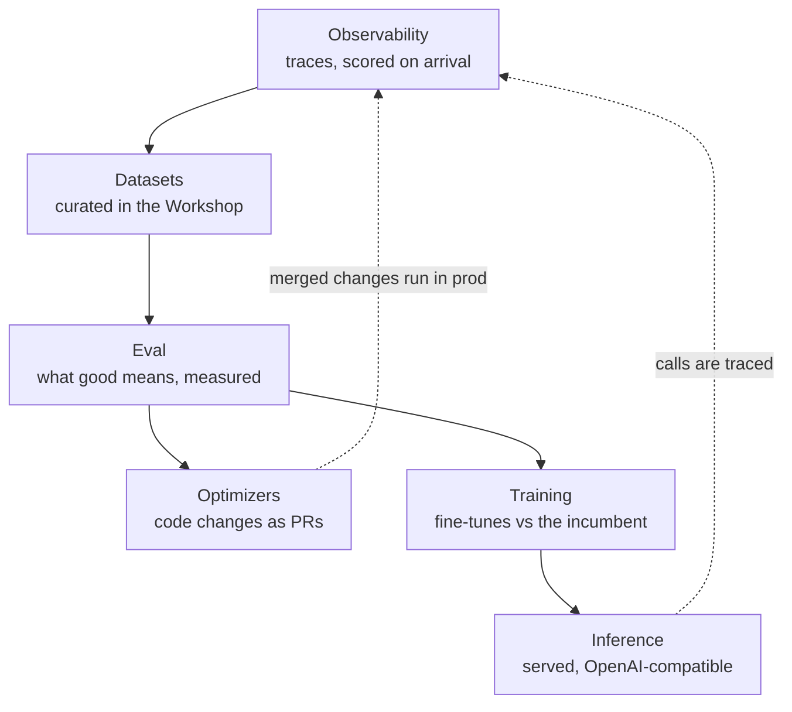

## What is Overmind?

Overmind helps you understand and improve the AI agents you run in production. It reads your agent's code, watches its real traffic, and gives you the machinery to turn that evidence into better agents: curated datasets, evaluators you trust, optimization runs that ship as pull requests, and — when the scaffolding stops paying — models of your own, trained on your own data and benchmarked against the model you run today.

The through-line is one loop, and every part of the platform is a stage in it:

Improvements always end in a review — an instrumentation PR, an optimization PR, a model-swap PR — never in Overmind silently changing what you ship.

## Who it's for

Teams with an agent doing a real job against real data: a support triager, a lead qualifier, a document extractor. You'll get the most value if the agent lives in a GitHub repository (Overmind reads the code to understand it) and you can send production traces (Overmind measures against situations the agent actually faced). You don't need an eval harness, a labeling pipeline, or training infrastructure — those are the parts Overmind provides.

## The product areas

<CardGroup cols={3}>
  <Card title="Agents" href="/core/agents" icon="robot">
    The working model of each agent in your code — structure, policy, and everything attached to it.
  </Card>
  <Card title="Datasets" href="/core/datasets" icon="database">
    Traces and files become scored, versioned datasets in the Data Workshop.
  </Card>
  <Card title="Observability" href="/core/observability" icon="eye">
    Every production run, with tokens, cost, latency, and quality scores on arrival.
  </Card>
  <Card title="Eval" href="/agent-testing/eval" icon="clipboard-check">
    Evaluators, eval sets, and runs — quality as a number you can plan around.
  </Card>
  <Card title="Optimizers" href="/agent-testing/optimizers" icon="wand-magic-sparkles">
    Candidate code changes, tested against your data, shipped as a PR.
  </Card>
  <Card title="Training" href="/models/training" icon="dumbbell">
    Fine-tune on your own data, benchmarked per metric against your production model.
  </Card>
  <Card title="Inference" href="/models/inference" icon="server">
    Your models, served and monitored, behind an OpenAI-compatible API.
  </Card>
  <Card title="Administration" href="/platform/administration" icon="gear">
    Projects, keys, connections, jobs, and billing.
  </Card>
  <Card title="Glossary" href="/platform/glossary" icon="book">
    One canonical definition per platform term.
  </Card>
</CardGroup>

## Where to start

The [Quickstart](/quickstart) takes you from a fresh account to an agent with traces, a scored dataset, and a first measurement in about fifteen minutes. If you'd rather read first, start with [Agents](/core/agents) — it explains the model everything else hangs off — then follow the loop: [Observability](/core/observability), [Datasets](/core/datasets), [Eval](/agent-testing/eval).
