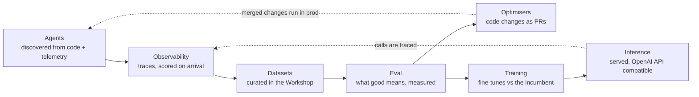

## What is Overmind?

Overmind helps you understand and improve the AI agents you run in production. It reads your agent's code and watches its production traffic. From that data you build test datasets, measure quality with evaluators, and ship improvements as pull requests. When prompt and code changes stop improving the score, Overmind can fine-tune a model on your own data and benchmark it against the model you use today.

Everything in Overmind is one loop, and each product area is a step in it:

Every change Overmind proposes arrives as a pull request in your repository: an observability PR, an optimisation PR, or a model-swap PR. You review and merge it. Overmind never silently changes what you ship.

## Who it's for

Teams with an agent doing a real job against real data: a support triager, a lead qualifier, a document extractor. You'll get the most value if the agent lives in a GitHub repository, since Overmind reads the code to understand it, and if you can send production traces, since Overmind measures against situations the agent actually faced. You don't need an eval harness, a labelling pipeline, or training infrastructure. Those are the parts Overmind provides.

## The product areas

<CardGroup cols={3}>
  <Card title="Agents" href="/core/agents" icon="robot">
    The working model of each agent in your code, with its structure, behaviour, and everything attached to it.
  </Card>
  <Card title="Datasets" href="/core/datasets" icon="database">
    Traces and files become scored, versioned datasets in the Data Workshop.
  </Card>
  <Card title="Observability" href="/core/observability" icon="eye">
    Every production run, with tokens, cost, latency, and quality scores on arrival.
  </Card>
  <Card title="Eval" href="/agent-testing/eval" icon="clipboard-check">
    Evaluators, eval sets, and runs. Define what good looks like and score your agent against it.
  </Card>
  <Card title="Optimisers" href="/agent-testing/optimisers" icon="wand-magic-sparkles">
    Candidate code changes, tested against your data, shipped as a PR.
  </Card>
  <Card title="Training" href="/models/training" icon="dumbbell">
    Fine-tune on your own data, benchmarked per metric against your production model.
  </Card>
  <Card title="Inference" href="/models/inference" icon="server">
    Your models, served and monitored, behind an OpenAI-compatible API.
  </Card>
  <Card title="Administration" href="/platform/administration" icon="gear">
    Projects, keys, connections, jobs, and billing.
  </Card>
  <Card title="Glossary" href="/platform/glossary" icon="book">
    One canonical definition per platform term.
  </Card>
</CardGroup>

## Where to start

The [Quickstart](/quickstart) takes you from a fresh account to an agent with traces, a scored dataset, and a first measurement in about fifteen minutes. If you'd rather read first, start with [Agents](/core/agents), since every other page builds on it, then follow the loop: [Observability](/core/observability), [Datasets](/core/datasets), [Eval](/agent-testing/eval).
