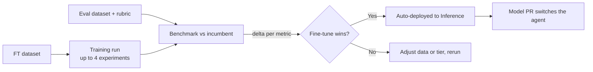

<Info>
  Training is available in early access with limited capacity. Reach out to [support@overmindlab.ai](mailto:support@overmindlab.ai) to have it enabled for your project.
</Info>

Training turns your agent's accumulated data into a model of your own. You pick a fine-tuning dataset, Overmind recommends which base models to try and how to train them, and every finished model is benchmarked — with your own evaluators — against the model your agent runs in production today. No training infrastructure on your side, and no leap of faith at the end: the question a fine-tune has to answer is "does it beat what we already ship?", per metric, before any traffic moves.

## Why fine-tune, and when

A frontier model rented per token is a reasonable default and a poor endgame for a specialized agent. Once an agent does one job at volume, a smaller model trained on that agent's real inputs and outputs tends to match or beat the generalist on the task while costing a fraction per call — and it's yours: private to your project, downloadable, not subject to a provider deprecating it.

The practical trigger is usually one of two things. Either [optimization runs](/agent-testing/optimizers) have plateaued — the scaffolding is as good as it gets and the remaining gap lives in the model — or inference cost and latency have become the problem. In both cases the prerequisite is the same: enough curated, real examples to teach from, which is exactly what [Datasets](/core/datasets) exists to accumulate.

## What a run needs

A training run is defined by four choices, made in the wizard's first section:

| Choice | Requirement |
| --- | --- |
| **Agent** | The agent whose job the model is learning; its production model becomes the benchmark baseline |
| **Training dataset** | A fine-tuning-intent dataset (chat-style `messages`, optionally with `tools`) |
| **Eval dataset** | A separate eval-intent dataset the finished model is measured on |
| **Rubric** | The eval set that does the measuring — the agent's active set is marked for you |

The separation between training and eval data is enforced, not advisory. Any training row whose source trace also appears in the eval dataset is excluded from training automatically, so the benchmark never scores data the model saw during training. Within the training data, a validation split (20% by default) is carved out — randomly with trace-safe grouping, or in order — or you can supply a distinct validation dataset.

Dataset validation happens before you launch, with the same checks the [Data Workshop](/core/datasets#the-data-workshop) applies at ingest: a dataset that's valid when you built it is valid when training starts, and problems surface as fixable findings up front rather than as a failed job an hour in. The wizard also warns when the data looks too thin to teach much.

## Choosing models and settings

You don't start from a blank hyperparameter form. Overmind reads your dataset's statistics — size, token distributions, tool usage — and recommends configurations across four model **tiers**, compact through large, each with a rationale, estimated cost, and estimated duration attached. Context length is derived from your actual data, and the model list is filtered to what your rows fit into; if your agent calls tools, only models with tool-calling support are offered.

The catalog spans current open-weight instruct families — Qwen, Llama, Gemma, Phi, Ministral, and others, from sub-1B compact models to 70B-class — with the in-product picker as the live source of truth for exactly what's available.

A single run trains up to **four experiments in parallel**, each its own model and settings. The right size is rarely obvious in advance, so the useful move is to let a compact model and a mid-tier model race and let the benchmark settle it.

Every recommended setting stays editable per experiment:

- **Training** — epochs, learning rate, batch size. Defaults scale with dataset size: small datasets get more passes, large ones fewer.
- **Method** — adapter training (LoRA) or full fine-tuning. Adapters train small additional matrices instead of all weights: cheaper and faster, and on small datasets usually indistinguishable from full fine-tuning in quality. LoRA rank, alpha, and dropout are exposed when you want them.

Each field shows its recommended value and a one-click reset back to it, so experimenting with the knobs is never a one-way door. A summary totals the estimated cost and duration before you commit, and runs are seeded so a rerun with the same inputs is reproducible.

{/* TODO(screenshot): Training wizard with tiered recommendations and per-experiment settings */}

## Watching a run

A launched run moves through **Queued → Preparing → Running → Deploying → Succeeded** (or Failed / Cancelled — both retryable and cancellable). The monitor shows each experiment live: progress and ETA, tokens processed, train and validation loss curves updating as the model learns, checkpoints as they're saved, and an append-only timeline of everything that happened. A run going wrong shows up in the curves — validation loss climbing away from train loss is visible long before the job ends — so you can cancel early instead of discovering the problem at the end.

Grouped experiments appear as cards you can focus one at a time, and each job reports its final cost when it completes.

{/* TODO(screenshot): Training monitor with loss curves across parallel experiments */}

## The benchmark: your fine-tune vs. your production model

This is the part that makes a Training run conclusive rather than hopeful. Each job spawns judge evaluations at three points:

1. **Baseline** — the agent's production model (the *incumbent*), snapshotted at submit time, scored on your eval dataset with your chosen rubric.
2. **Checkpoint** — intermediate checkpoints scored the same way, so you can see quality developing during training.
3. **Final** — the finished model, scored on the same data with the same rubric.

The headline number is the **baseline delta**: final score minus incumbent score, per metric. The comparison target is deliberately the model your agent actually runs — typically a frontier model — not the untouched base model, because "better than an untrained 7B" is trivia while "better than the GPT-class model we pay for today" is a decision.

When your eval dataset's references are labels, the benchmark also produces classification metrics — per-class precision, recall, F1, and support, with accuracy and a confusion matrix — which is usually the clearest lens on classifier-style agents like routers and triagers.

## After training

A succeeded run deploys its model automatically; there is no separate publish step. The model appears in [Inference](/models/inference), ready to serve and call, and on the agent's **Models** tab alongside the incumbent. Checkpoints and final weights are downloadable if you want to run the model elsewhere — the weights are yours. Everything stays linked: a served model traces back to its training job, its exact dataset commit, and the eval scores that justified it.

When the benchmark says the fine-tune wins, the last step is switching your agent over. A **Model PR** does this the same way the Optimizer ships changes: Overmind edits your repository to point the agent at the new model and opens the pull request, and the switch happens through your normal review.

## Good to know

- Model quality comes almost entirely from the data. A few hundred clean, representative, trace-sourced rows beat thousands of noisy ones; get the Workshop verdict to **Ready** before spending on a run.
- The training dataset is locked while the job runs — see [Datasets](/core/datasets#constraints-worth-knowing). Finish curation first, or duplicate the dataset to keep working.
- A run is rejected up front if your longest row exceeds the chosen model's trainable context, with an explicit message — another reason the wizard filters the catalog by your token distributions.
- During early access, capacity is limited; very large models or many parallel runs may queue.
