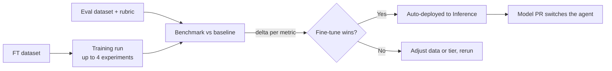

Training turns your agent's accumulated data into a model of your own. You pick a fine-tuning dataset, Overmind recommends which base models to try and how to train them, and every finished model is benchmarked with your own evaluators against the model your agent runs in production today. You don't need training infrastructure, and you see per-metric benchmark results before any traffic moves. The question a fine-tune has to answer is "does it beat what we already ship?", per metric, before anything changes.

## Why fine-tune, and when

Paying per token for a frontier model is a fine way to start. But once an agent does one job at volume, a smaller model trained on that agent's real data often matches it at a fraction of the cost per call. And it's yours: private to your project, downloadable, not subject to a provider deprecating it.

The practical trigger is usually one of two things. Either [optimisation runs](/agent-testing/optimisers) have plateaued, meaning the prompts and code around the model are as good as they get and the remaining gap is in the model, or inference cost and latency have become the problem. In both cases the prerequisite is the same: enough curated, real examples to teach from, which is exactly what [Datasets](/core/datasets) exists to accumulate.

## What a run needs

A training run is defined by four choices, made in the wizard's first section:

| Choice | Requirement |
| --- | --- |
| **Agent** | The agent whose job the model is learning; its production model becomes the benchmark baseline |
| **Training dataset** | A fine-tuning-intent dataset (chat-style `messages`, optionally with `tools`) |
| **Eval dataset** | A separate eval-intent dataset the finished model is measured on |
| **Rubric** | The eval set that does the measuring, chosen from the agent's sets |

The separation between training and eval data is enforced, not advisory. Any training row whose source trace also appears in the eval dataset is excluded from training automatically, so the benchmark never scores data the model saw during training. Within the training data, a validation split (20% by default) is carved out, either randomly with trace-safe grouping or in order.

Dataset validation happens before you launch, with the same checks the [Data Workshop](/core/datasets#the-data-workshop) applies at ingest. A dataset that's valid when you built it is valid when training starts, and problems surface as fixable findings up front instead of as a failed job an hour in. The wizard also warns when the data looks too thin to teach much.

## Choosing models and settings

You don't start from a blank hyperparameter form. Overmind reads your dataset's statistics (size, token distributions, tool usage) and recommends configurations across four model **tiers**, compact through large, each with a rationale, estimated cost, and estimated duration attached. Context length is derived from your actual data, so a model whose context your longest rows would overflow is rejected at launch rather than silently truncated. If your agent calls tools, only models with tool-calling support are offered.

The catalogue spans current open-weight instruct families, from 350M compact models to 35B-class mixture-of-experts, and is listed in full under [Supported models](#supported-models) below.

A single run trains up to **four experiments in parallel**, each its own model and settings. The right size is rarely obvious in advance, so the useful move is to train a compact model and a mid-tier model side by side and let the benchmark decide.

Every recommended setting stays editable per experiment:

- **Training**: epochs, learning rate, batch size. Defaults scale with dataset size. Small datasets get more passes, large ones fewer.
- **Method**: adapter training (LoRA) or full fine-tuning. Adapters train small additional matrices instead of all weights, which is cheaper and faster, and on small datasets usually indistinguishable from full fine-tuning in quality. LoRA rank, alpha, and dropout are exposed when you want them.

Each field shows its recommended value and a one-click reset back to it, so you can always get back to the recommended setup. A summary totals the estimated cost and duration before you commit, and runs are seeded so a rerun with the same inputs is reproducible.

{/* TODO(screenshot): Training wizard with tiered recommendations and per-experiment settings */}

## Supported models

Overmind fine-tunes 24 open-weight instruct models across six families: **Qwen 3.6**, **Qwen 3.5**, **Qwen 3**, **Qwen 2.5**, **Llama 3**, and **Antares**. They range from 350M to 35B parameters, and every one of them supports both LoRA adapter training and full fine-tuning, serves through the same [OpenAI-compatible API](/models/inference#calling-your-model), and produces weights you can download and run anywhere.

How to read the columns:

- **Parameters**: total weights. Mixture-of-experts models also show the parameters active per token, which is what their inference cost tracks.
- **Tier**: the size band the wizard groups its recommendations by, compact through large. Training a compact and a mid model side by side is the standard move.
- **Context window**: the model's maximum context at inference.
- **Max training context**: the longest sequence you can fine-tune on. It is often shorter than the inference context, and a run is rejected up front if your longest row exceeds it.
- **Tool calling**: whether the model can be trained and served with `tools`. If your agent calls tools, only these models are offered.
- **Methods**: LoRA adapter training, full fine-tuning, or both.

<AccordionGroup>
  <Accordion title="Qwen 3.6 — 1 model" icon="rocket">
    The newest Qwen generation on the platform, and the strongest published coding and maths scores in the Qwen line. Mid tier, 256K context window.

    | Model | Parameters | Tier | Context window | Max training context | Tool calling | Methods |
    | --- | --- | --- | --- | --- | --- | --- |
    | **Qwen 3.6 27B** | 27B | Mid | 256K | 32K | Yes | LoRA · Full |
  </Accordion>
  <Accordion title="Qwen 3.5 — 6 models" icon="bolt">
    The default recommendation for most agents. A 256K context window at every size, tool calling from 0.8B up, and compact models trainable at their full 256K context, the longest in the catalogue.

    | Model | Parameters | Tier | Context window | Max training context | Tool calling | Methods |
    | --- | --- | --- | --- | --- | --- | --- |
    | **Qwen 3.5 0.8B** | 0.8B | Compact | 256K | 256K | Yes | LoRA · Full |
    | **Qwen 3.5 2B** | 2B | Compact | 256K | 256K | Yes | LoRA · Full |
    | **Qwen 3.5 4B** | 4B | Compact | 256K | 256K | Yes | LoRA · Full |
    | **Qwen 3.5 9B** | 9B | Small | 256K | 64K | Yes | LoRA · Full |
    | **Qwen 3.5 27B** | 27B | Mid | 256K | 32K | Yes | LoRA · Full |
    | **Qwen 3.5 35B** | 35B total, 3B active | Large | 256K | 64K | Yes | LoRA · Full |
  </Accordion>
  <Accordion title="Qwen 3 — 7 models" icon="cubes">
    The widest size ladder in the catalogue, 0.6B through 32B, plus a code-specialised mixture-of-experts model. Useful when you want to hold the family constant and vary only size across parallel experiments.

    | Model | Parameters | Tier | Context window | Max training context | Tool calling | Methods |
    | --- | --- | --- | --- | --- | --- | --- |
    | **Qwen 3 0.6B** | 0.6B | Compact | 40K | 40K | No | LoRA · Full |
    | **Qwen 3 1.7B** | 1.7B | Compact | 40K | 40K | Yes | LoRA · Full |
    | **Qwen 3 4B** | 4B | Compact | 40K | 40K | Yes | LoRA · Full |
    | **Qwen 3 8B** | 8B | Small | 40K | 40K | Yes | LoRA · Full |
    | **Qwen 3 14B** | 14B | Mid | 40K | 40K | Yes | LoRA · Full |
    | **Qwen 3 Coder 30B** | 30B total, 3B active | Mid | 256K | 64K | Yes | LoRA · Full |
    | **Qwen 3 32B** | 32B | Large | 40K | 40K | Yes | LoRA · Full |
  </Accordion>
  <Accordion title="Qwen 2.5 — 5 models" icon="box-archive">
    The mature, heavily-benchmarked generation, including a dedicated coder model at 32B. Worth keeping when an existing pipeline is already tuned around it.

    | Model | Parameters | Tier | Context window | Max training context | Tool calling | Methods |
    | --- | --- | --- | --- | --- | --- | --- |
    | **Qwen 2.5 0.5B Instruct** | 0.5B | Compact | 128K | 32K | No | LoRA · Full |
    | **Qwen 2.5 7B Instruct** | 7B | Small | 128K | 32K | Yes | LoRA · Full |
    | **Qwen 2.5 14B Instruct** | 14B | Mid | 128K | 32K | Yes | LoRA · Full |
    | **Qwen 2.5 32B Instruct** | 32B | Large | 128K | 32K | Yes | LoRA · Full |
    | **Qwen 2.5 Coder 32B Instruct** | 32B | Large | 128K | 32K | Yes | LoRA · Full |
  </Accordion>
  <Accordion title="Llama 3 — 3 models" icon="paw">
    Meta's instruct models, all three trainable at their full 128K context. The natural choice when your rows are long and you want a compact model.

    | Model | Parameters | Tier | Context window | Max training context | Tool calling | Methods |
    | --- | --- | --- | --- | --- | --- | --- |
    | **Llama 3.2 1B Instruct** | 1B | Compact | 128K | 128K | Yes | LoRA · Full |
    | **Llama 3.2 3B Instruct** | 3B | Compact | 128K | 128K | Yes | LoRA · Full |
    | **Llama 3.1 8B Instruct** | 8B | Small | 128K | 128K | Yes | LoRA · Full |
  </Accordion>
  <Accordion title="Antares — 2 models" icon="shield-halved">
    Security-specialised compact models, trained for vulnerability localisation. Small enough to serve cheaply at volume on a narrow, high-frequency job.

    | Model | Parameters | Tier | Context window | Max training context | Tool calling | Methods |
    | --- | --- | --- | --- | --- | --- | --- |
    | **Antares 350M** | 350M | Compact | 32K | 32K | Yes | LoRA · Full |
    | **Antares 1B** | 1.8B | Compact | 128K | 32K | Yes | LoRA · Full |
  </Accordion>
</AccordionGroup>

<Note>
The in-product picker is the live source of truth for exactly what's available to your project, and `GET /api/v1/models` lists what you can call. New models are added as the open-weight families release, so this table lags the console by a release or two.
</Note>

## Watching a run

A launched run moves through **Queued → Preparing → Running → Deploying → Succeeded**, or ends as Failed or Cancelled, both of which can be retried. The monitor shows each experiment live: progress and ETA, tokens processed, train and validation loss curves updating as the model learns, and an append-only timeline of everything that happened. A run going wrong shows up in the curves, since validation loss climbing away from train loss is visible long before the job ends, and you can cancel early instead of discovering the problem at the end.

Grouped experiments appear as cards you can focus one at a time, and each job reports its final cost when it completes.

{/* TODO(screenshot): Training monitor with loss curves across parallel experiments */}

## The benchmark: your fine-tune vs. your production model

This is the part that makes a Training run conclusive. Each job spawns judge evaluations at two points:

1. **Baseline**: the agent's production model, snapshotted at submit time, scored on your eval dataset with your chosen rubric.
2. **Final**: the finished model, scored on the same data with the same rubric.

The headline number is the **baseline delta**, final score minus baseline score, per metric. The benchmark deliberately compares against the model your agent actually runs, not the untouched base model, because that's the comparison a switch decision needs.

When your eval dataset's references are labels, the benchmark also produces classification metrics: per-class precision, recall, F1, and support, with accuracy and a confusion matrix. For classifier-style agents like routers and triagers, this is usually the clearest lens.

## After training

A succeeded run deploys its model automatically; there is no separate publish step. The model appears in [Inference](/models/inference), ready to serve and call, and on the agent's **Models** tab alongside the baseline. The final weights belong to you and are downloadable if you want to run the model elsewhere. Everything stays linked, so a served model traces back to its training job, its exact dataset commit, and the eval scores that justified it.

When the benchmark says the fine-tune wins, the last step is switching your agent over. A **Model PR** does this the same way the Optimiser ships changes: Overmind edits your repository to point the agent at the new model and opens the pull request, and the switch happens through your normal review.

## Good to know

- Model quality comes almost entirely from the data. A few hundred clean, representative, trace-sourced rows beat thousands of noisy ones. Get the Workshop verdict to **Ready** before spending on a run.
- The training dataset is locked while the job runs (see [Datasets](/core/datasets#constraints-worth-knowing)). Finish curation first, or duplicate the dataset to keep working.
- A run is rejected up front, with an explicit message, if your longest row exceeds the chosen model's trainable context.
